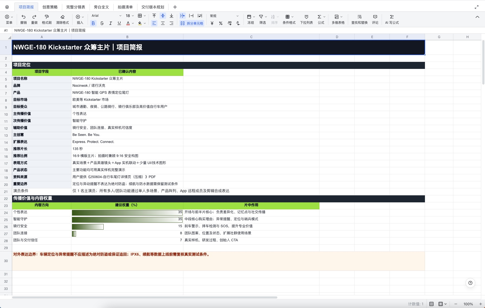
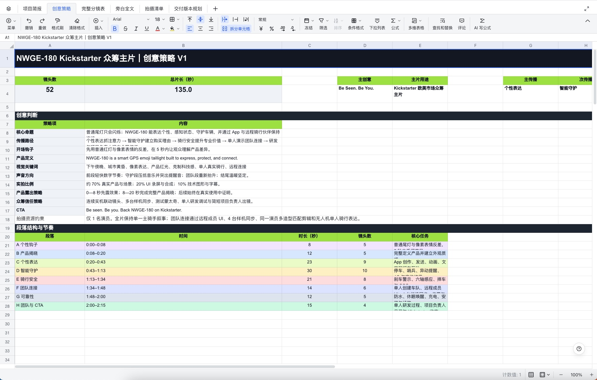
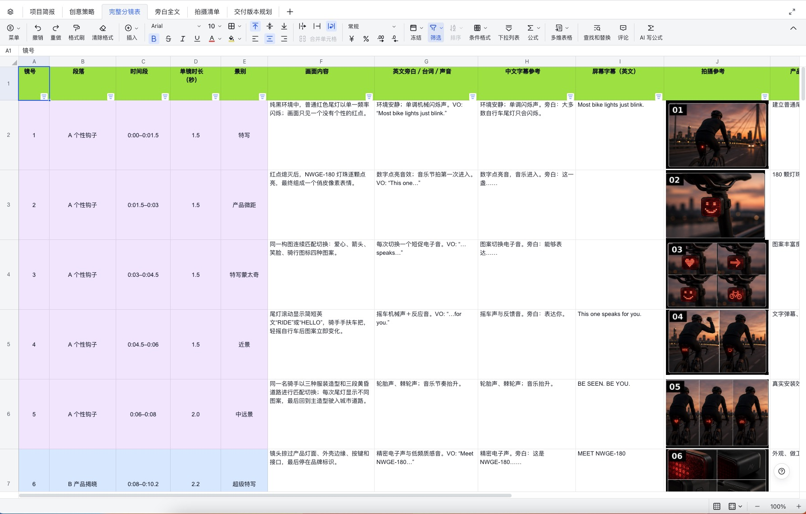
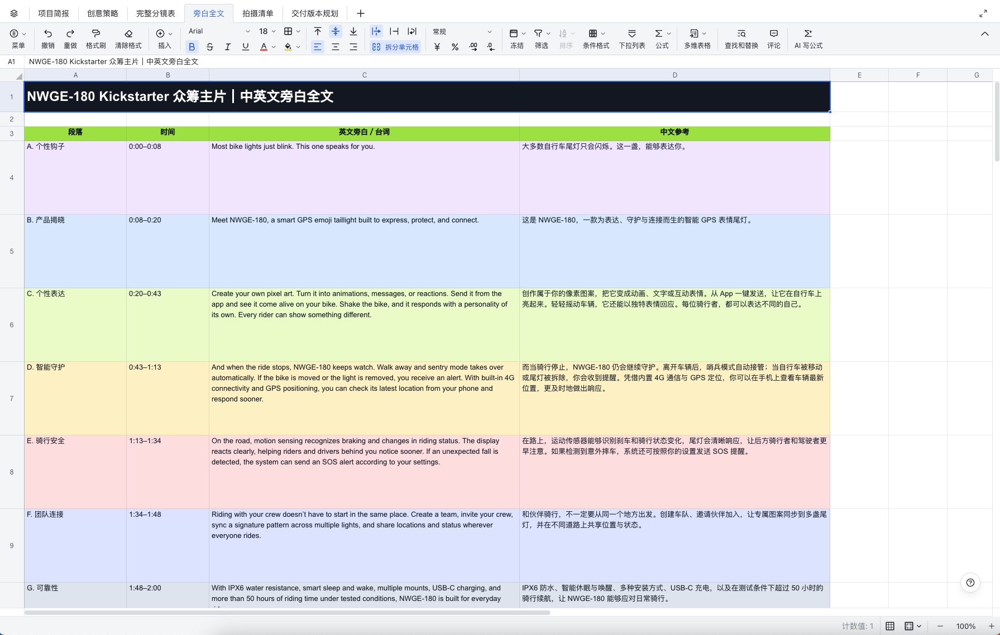

# vane-product-video-script

> 把零散的产品资料，转化为可拍摄、可执行的商业视频脚本与完整分镜。

`vane-product-video-script` 是由 Vane 创建的产品视频策划、脚本与分镜 Skill。

它适用于商业产品宣传片、Kickstarter 众筹主片、产品功能片、故事型广告、电商转化短片、新品发布片、官网产品片、展会招商片和社交媒体商业短片。

它不只是直接生成一篇文案，而是按照真实商业视频项目的工作方式，依次完成：

```text
选择视频用途
→ 整理产品资料
→ 推荐脚本策略
→ 确认创意或故事
→ 编写正式脚本
→ 拆解完整分镜
→ 规划拍摄与交付
```

## 它解决什么问题

普通 AI 在编写产品视频脚本时，经常出现这些问题：

- 没有确认视频用途就直接开始写；
- 平均介绍所有功能，没有核心卖点；
- 用旁白解释功能，画面却无法证明；
- 只有氛围和“科技感”，观众看不懂产品；
- 为了塞入功能而破坏故事；
- 忽略演员、场地、预算和拍摄时间；
- 创意还没确认，就直接生成几十个镜头；
- 分镜描述过于模糊，无法交给导演和摄影执行；
- 对性能、认证、量产或产品效果做出不可靠承诺。

这个 Skill 会先解决“为什么拍、给谁看、在哪里发布、希望观众看完做什么”，然后再决定“用什么创意、怎样组织卖点、怎样拍、怎样证明产品价值”。

## 核心能力

- 写脚本前强制确认视频用途；
- 自动整理零散的产品资料；
- 区分核心卖点、辅助卖点和字幕信息；
- 推荐适合的脚本手法与视频呈现形式；
- 支持分析优秀案例和竞品视频；
- 支持功能证明型、故事场景型和混合型脚本；
- 先确认创意或故事，再进入正式脚本；
- 输出导演、摄影、制片和后期可执行的完整分镜；
- 支持单演员、有限场地、自然光和预算约束；
- 针对 Kickstarter 众筹视频提供真实性规则；
- 检查夸大承诺、功能边界和脚本可执行性；
- 按需导出多工作表 `.xlsx` 分镜文件；
- 默认不自动生成分镜图片，避免画面与镜头错位。

## 支持的视频类型

| 视频用途 | 主要任务 |
|---|---|
| Kickstarter / 众筹主片 | 解释产品、证明样机、建立信任并推动支持 |
| 产品宣传主片 | 建立品牌认知，集中表达产品核心价值 |
| 产品功能介绍片 | 清晰演示功能、使用方式和可见结果 |
| 故事型产品广告 | 通过人物目标、障碍和变化呈现产品价值 |
| 新品发布 / 产品揭晓片 | 制造期待，完成产品亮相和卖点释放 |
| 电商转化短片 | 快速展示痛点、卖点、证明和购买理由 |
| 官网产品片 | 帮助访问者快速理解产品和品牌定位 |
| 展会 / 经销商 / 招商片 | 展示产品价值、商业机会和合作可信度 |
| 社交媒体商业短片 | 在较短时间内完成钩子、信息传达和行动引导 |
| 自定义用途 | 根据平台、市场、时长和商业目标重新规划 |

## 可选择的脚本形式

Skill 会根据产品特点和制作条件推荐以下表达形式：

1. 功能证明型；
2. 故事场景型；
3. 功能与故事混合型；
4. 产品英雄型；
5. 测试验证型；
6. 创始人 / 团队信任型；
7. 根据项目条件自动推荐。

推荐时会综合判断产品最强的视觉资产、用户最大的信任障碍、功能能否实拍、产品外观、人物情绪、演员、场地、样机、拍摄时间、后期能力和项目预算。

## 工作流程

### 1. 确认视频用途

确认发布平台、目标市场、预计时长、目标受众、目标行动、横竖版和制作条件。

### 2. 整理产品资料

将详情页、说明书、PDF、产品图片、App 截图、竞品链接和零散说明整理为统一项目简报。

### 3. 推荐脚本策略

输出主推荐脚本形式、核心命题、创意概念、视觉关键词、产品露出策略、推荐理由、一个备选方向和不推荐方向。

### 4. 确认结构或故事

功能型视频先确认段落结构、卖点顺序和时间占比。故事型视频先确认主角、目标、障碍、产品介入方式、解决过程和结尾闭环。

### 5. 编写正式脚本

正式脚本可以包含场次、时间、人物行动、中英文旁白、屏幕文字、环境声、音效、音乐节点、功能进入方式和表达边界。

### 6. 拆解完整分镜

每个镜头写清人物、地点、动作、产品状态、画面结果、景别、机位、运动、焦点、连续性、实拍或后期方式，以及安全和执行要求。

### 7. 拍摄与交付规划

根据项目需要整理场景、演员、服装、道具、样机、App、摄影灯光、自然光、安全风险、替代方案和多版本规划。

### 8. 质量检查与导出

正式交付前进行质量评分。低于 80 分时优先修订，再按需导出 `.xlsx` 分镜文件。

## 需要提供什么

最低需要提供：

- 产品是什么；
- 目标用户是谁；
- 3 个核心卖点；
- 视频用途；
- 预计时长；
- 发布平台和市场；
- 可用样机与制作条件。

资料不需要提前整理，可以直接提供产品详情页、产品说明书、PDF、图片、视频、App 截图、竞品链接、已有文案、拍摄限制和零散想法。

## 最终可以获得什么

- 产品项目简报；
- 受众与传播任务分析；
- 核心卖点排序；
- 脚本策略推荐；
- 创意概念；
- 故事结构或功能段落结构；
- 中英文旁白与屏幕文字；
- 正式文字脚本；
- 完整镜头分镜；
- 拍摄清单；
- 制作风险与替代方案；
- 横版、竖版和精简版本规划；
- 可编辑的 XLSX 分镜文件。

## 真实项目效果预览

以下示例来自 `NWGE-180 Kickstarter 众筹主片`：135 秒、52 个镜头、单演员执行，覆盖项目简报、创意策略、完整分镜、中英文旁白、拍摄清单和交付版本规划。

### 项目简报



### 创意策略



### 完整分镜表



### 中英文旁白全文



### 在线查看完整工作簿

[打开 NWGE-180 Kickstarter 众筹主片完整表格](https://ccn5x247uoj0.feishu.cn/sheets/LnF1sUbV1h8UIit7YfXcjnqtnZf?sheet=0qIIKi)

> 在线表格包含项目简报、创意策略、完整分镜、旁白全文、拍摄清单和交付版本规划。访问权限以飞书分享设置为准。

## 快速安装

### Codex

将仓库克隆到 Codex 的 Skills 目录：

```bash
git clone https://github.com/VaneAi888/vane-product-video-script.git ~/.codex/skills/vane-product-video-script
```

安装后重新打开 Codex，并在任务中调用：

```text
使用 $vane-product-video-script
```

如果使用自定义的 Codex Skills 目录，请将仓库放入对应的 Skills 文件夹。

### 手动安装

1. 下载本仓库 ZIP；
2. 解压文件；
3. 确认文件夹名称为 `vane-product-video-script`；
4. 将文件夹放入客户端的 Skills 目录；
5. 重新打开客户端；
6. 使用 `$vane-product-video-script` 调用。

不同 Agent 客户端的 Skills 目录和安装方式可能不同，请以对应客户端的说明为准。

## 使用示例

### 从零开始规划产品视频

```text
使用 $vane-product-video-script。

我需要给一个新产品制作宣传视频。请先让我选择视频用途，
然后帮我整理产品资料并推荐脚本方向。
```

### Kickstarter 众筹主片

```text
使用 $vane-product-video-script。

这是一款带 GPS 定位和安全尾灯的骑行产品。
我要制作一支面向欧美市场的 90 秒 Kickstarter 众筹主片。

目前只有一名演员，可以从下午拍到傍晚，
真实样机和 App 都可以演示。

请先整理产品简报和脚本策略，不要直接拆分镜。
```

### 故事型产品广告

```text
使用 $vane-product-video-script。

请按照故事型产品广告模式处理这个产品。
先确定主角、目标、障碍、产品介入方式和结尾闭环，
等我确认故事后再写正式脚本。
```

### 分镜与 XLSX 导出

```text
脚本已经确认。

请拆解完整分镜，检查时长和拍摄可执行性，
确认后导出 XLSX 分镜工作簿。
```

## 项目结构

```text
vane-product-video-script/
├── SKILL.md
├── README.md
├── LICENSE
├── agents/
│   └── openai.yaml
├── assets/
│   ├── product-brief-template.md
│   ├── storyboard-template.md
│   └── xlsx-workbook-spec.md
├── examples/
│   └── invocation-examples.md
├── references/
│   ├── high-scoring-models.md
│   ├── quality-rubric.md
│   └── use-cases.md
└── .github/
    └── images/
        ├── nwge-project-brief.jpg
        ├── nwge-creative-strategy.jpg
        ├── nwge-storyboard.jpg
        ├── nwge-bilingual-voiceover.jpg
        └── vane-wechat-qr.jpg
```

## 使用边界

这个 Skill 主要用于商业产品视频策划、脚本和分镜，不建议直接用于：

- 普通电影或电视剧剧本；
- 与产品无关的纯文学创作；
- 只需要一句广告语的简单任务；
- 未经确认直接批量生成分镜画面；
- 虚构产品认证、性能、产能、价格或交付能力；
- 将定位提醒描述为绝对防盗或保证找回；
- 用 AI 随意生成与真实产品不一致的手机 UI。

需要生成分镜图片时，建议在文字分镜确认后逐镜生成，再进行固定版式排版。

## 兼容性

- 适用于支持 Agent Skills 的 Codex 或兼容客户端；
- Skill 主体为中文；
- 支持生成中英文旁白；
- 最终 XLSX 导出需要客户端具备电子表格文件创建能力；
- 图片、视频、网页和 PDF 分析能力取决于当前客户端可用工具。

## 作者与联系

Created by **Vane**

- GitHub：[@VaneAi888](https://github.com/VaneAi888)
- Repository：[vane-product-video-script](https://github.com/VaneAi888/vane-product-video-script)

欢迎交流产品视频脚本、商业内容创作和 Agent Skill：


## License

本项目采用 [Creative Commons Attribution 4.0 International（CC BY 4.0）](LICENSE) 许可。

你可以自由使用、复制、传播、商业使用和修改本项目，但必须：

1. 注明原作者为 **Vane**；
2. 提供本项目或许可协议的链接；
3. 如果进行了修改，明确注明“基于 Vane 的 `vane-product-video-script` 修改”；
4. 不得暗示 Vane 对修改版本或使用方式进行背书。
